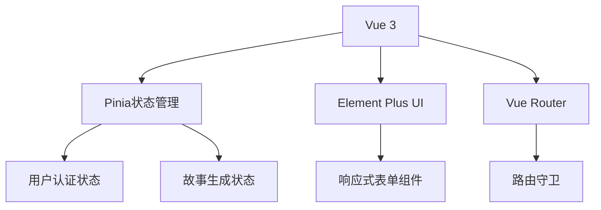
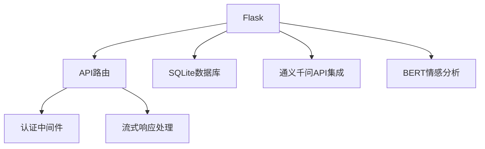
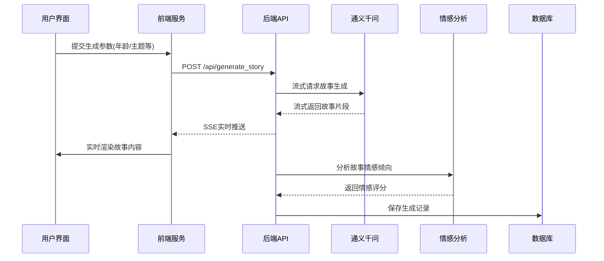

# 儿童故事生成与分析系统

## 项目概述
本项目是一个基于Vue.js和Flask的AI儿童故事生成平台，集成通义千问大语言模型和BERT情感分析模型，提供以下核心功能：
- 根据儿童年龄、主题偏好等参数生成个性化故事
- 实时流式故事内容生成与展示
- 故事内容情感分析与评估
- 用户账户管理与历史记录

## 技术架构

### 前端架构


### 后端架构


### 关键技术栈
- **前端**: Vue 3 + Pinia + Element Plus + Axios
- **后端**: Python Flask + SQLite + Requests
- **AI服务**: 通义千问(qwen-turbo) + BERT中文模型
- **实时通信**: Server-Sent Events (SSE)

## 核心功能实现

### 1. 故事生成流程


### 2. 关键代码实现

#### 后端流式处理核心 (app.py)
```python
@app.route('/api/generate_story', methods=['POST'])
@jwt_required()
def generate_story():
    # 参数验证与处理
    data = request.get_json()
    age = data.get('age')
    theme = data.get('theme')
    
    # 构造通义千问请求
    payload = {
        "model": "qwen-turbo",
        "input": {
            "messages": [
                {
                    "role": "system",
                    "content": f"你是一位儿童故事作家，请为{age}岁儿童创作关于{theme}的故事..."
                }
            ]
        },
        "parameters": {
            "stream": True,
            "incremental_output": True
        }
    }

    def generate():
        # 流式请求AI服务
        with requests.post(QWEN_API_URL, json=payload, 
                          headers=API_HEADERS, stream=True) as resp:
            for line in resp.iter_lines():
                if line:
                    decoded = line.decode('utf-8')
                    if decoded.startswith('data:'):
                        data = json.loads(decoded[5:])
                        if 'output' in data:
                            # 实时情感分析
                            sentiment = analyze_sentiment(data['output']['text'])
                            yield f"data: {json.dumps({
                                'text': data['output']['text'],
                                'sentiment': sentiment
                            })}\n\n"

    return Response(generate(), mimetype='text/event-stream')
```

#### 前端流式渲染 (HomeView.vue)
```javascript
const generateStory = async () => {
  loading.value = true;
  storyContent.value = '';
  
  try {
    const response = await fetch(`${API_BASE}/generate_story`, {
      method: 'POST',
      headers: {
        'Content-Type': 'application/json',
        'Authorization': `Bearer ${authStore.token}`
      },
      body: JSON.stringify({
        age: form.age,
        theme: form.theme,
        length: form.length
      })
    });

    const reader = response.body.getReader();
    const decoder = new TextDecoder();
    
    while (true) {
      const { done, value } = await reader.read();
      if (done) break;
      
      const chunk = decoder.decode(value);
      chunk.split('\n').forEach(line => {
        if (line.startsWith('data:')) {
          const data = JSON.parse(line.substring(5));
          storyContent.value += data.text;
          
          // 更新情感分析图表
          if (data.sentiment) {
            updateSentimentChart(data.sentiment);
          }
        }
      });
    }
  } catch (error) {
    ElMessage.error('故事生成失败');
  } finally {
    loading.value = false;
  }
};
```

#### 用户认证实现 (auth.js)
```javascript
export const useAuthStore = defineStore('auth', {
  state: () => ({
    token: localStorage.getItem('token') || null,
    user: JSON.parse(localStorage.getItem('user')) || null
  }),
  
  actions: {
    async login(credentials) {
      const { data } = await axios.post('/api/login', credentials);
      this.token = data.token;
      this.user = data.user;
      
      localStorage.setItem('token', data.token);
      localStorage.setItem('user', JSON.stringify(data.user));
      
      axios.defaults.headers.common['Authorization'] = `Bearer ${data.token}`;
    },
    
    logout() {
      this.token = null;
      this.user = null;
      localStorage.removeItem('token');
      localStorage.removeItem('user');
      delete axios.defaults.headers.common['Authorization'];
    }
  }
});
```

## 部署指南

### 后端服务部署
1. 安装依赖：
```bash
pip install -r requirements.txt
```

2. 配置环境变量：
```bash
cp .env.example .env
# 编辑.env文件配置以下内容：
# - 通义千问API密钥
# - JWT密钥
# - 数据库配置
```

3. 启动服务：
```bash
# 开发模式
flask run --port 5000

# 生产模式建议使用:
gunicorn -w 4 -b :5000 app:app
```

### 前端开发与构建
1. 安装依赖：
```bash
cd ai_chat_ui
npm install
```

2. 开发模式：
```bash
npm run dev
```

3. 生产构建：
```bash
npm run build
# 输出到dist目录，可部署到任何静态文件服务器
```

## 未来优化方向

### 功能扩展
1. **多模态输出**: 集成图像生成模型，为故事配图
2. **交互式故事**: 允许用户在故事关键节点选择不同情节走向
3. **家长控制面板**: 提供内容过滤和阅读进度跟踪
4. **多语言支持**: 支持生成不同语言版本的故事

### 技术优化
1. **性能优化**:
   - 前端: 实现虚拟滚动优化长故事渲染性能
   - 后端: 添加Redis缓存高频请求结果
2. **架构改进**:
   - 微服务化拆分故事生成、情感分析等服务
   - 引入消息队列处理高并发生成请求
3. **AI模型优化**:
   - 微调专属儿童故事生成模型
   - 实现更精细的情感分析维度
4. **监控与运维**:
   - 添加Prometheus监控指标
   - 实现日志集中收集与分析

## 项目结构
```
├── backend/                # Flask后端服务
│   ├── app.py              # 主应用入口
│   ├── requirements.txt    # Python依赖
│   ├── .env                # 环境配置
│   └── database.db         # SQLite数据库文件
│
├── ai_chat_ui/             # Vue前端项目
│   ├── public/             # 静态资源
│   ├── src/                # 源代码
│   │   ├── assets/         # 静态资源
│   │   ├── components/     # 公共组件
│   │   ├── router/         # 路由配置
│   │   ├── stores/         # Pinia状态管理
│   │   ├── views/          # 页面组件
│   │   ├── App.vue         # 根组件
│   │   └── main.js         # 应用入口
│   ├── package.json        # 前端依赖
│   └── vite.config.js      # 构建配置
│
├── .gitignore              # Git忽略规则
└── README.md               # 项目文档
