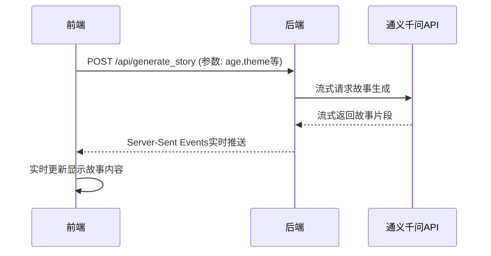

# 儿童故事生成与分析系统

## 项目简介
一个基于Vue.js和Flask的儿童故事生成系统，集成通义千问AI模型，支持：
- 根据年龄、主题等参数生成儿童故事
- 实时流式输出故事内容
- 故事情感分析
- 用户注册登录功能

## 技术架构
```
前端：Vue.js + Element Plus
后端：Python Flask + SQLite
AI服务：通义千问(qwen-turbo)
情感分析：BERT中文模型
```

## 核心功能逻辑

### 1. 故事生成流程


### 2. 关键代码

#### 后端流式响应 (app.py)
```python
@app.route('/api/generate_story', methods=['POST'])
def generate_story():
    # ...验证逻辑...
    
    def generate():
        with requests.post(url, json=payload, headers=headers, stream=True) as response:
            for line in response.iter_lines():
                if line:
                    decoded_line = line.decode('utf-8')
                    if decoded_line.startswith('data:'):
                        data = json.loads(decoded_line[5:])
                        if 'output' in data:
                            yield f"data: {json.dumps({'text': data['output']['text']})}\n\n"
    
    return Response(generate(), mimetype='text/event-stream')
```

#### 前端流式处理 (HomeView.vue)
```javascript
const response = await fetch("http://localhost:5000/api/generate_story", {
  method: "POST",
  headers: {
    "Content-Type": "application/json",
    Authorization: `Bearer ${authStore.token}`,
  },
  body: JSON.stringify({
    age: storyForm.value.age,
    theme: storyForm.value.theme,
    requirements: storyForm.value.requirements,
    length: storyForm.value.length,
  }),
});

const reader = response.body.getReader();
const decoder = new TextDecoder();

while (true) {
  const { done, value } = await reader.read();
  if (done) break;
  
  const chunk = decoder.decode(value);
  const lines = chunk.split('\n');
  
  for (const line of lines) {
    if (line.startsWith('data:')) {
      const data = JSON.parse(line.substring(5).trim());
      if (data.text) {
        aiMsg.content += data.text; // 实时更新内容
      }
    }
  }
}
```

## 部署运行

### 后端服务
1. 安装依赖：
```bash
pip install -r requirements.txt
```

2. 配置环境变量：
```bash
cp .env.example .env
# 编辑.env文件配置API密钥等
```

3. 启动服务：
```bash
python backend/app.py
```

### 前端开发
1. 进入前端目录：
```bash
cd ai_chat_ui
```

2. 安装依赖：
```bash
npm install
```

3. 启动开发服务器：
```bash
npm run dev
```

## 项目结构
```
├── backend/            # Flask后端
│   ├── app.py          # 主应用逻辑
│   └── database.db     # SQLite数据库
├── ai_chat_ui/         # Vue前端
│   ├── src/
│   │   ├── views/      # 页面组件
│   │   └── stores/     # 状态管理
└── README.md           # 项目文档
