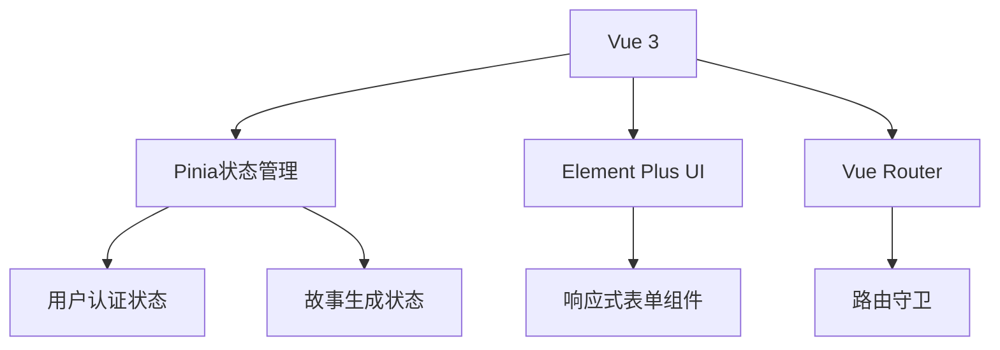
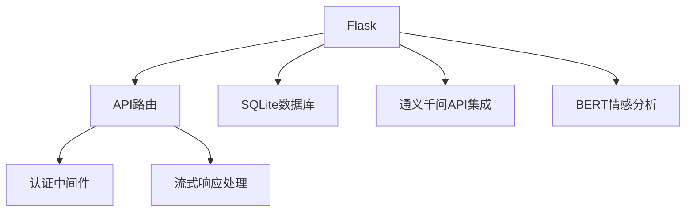
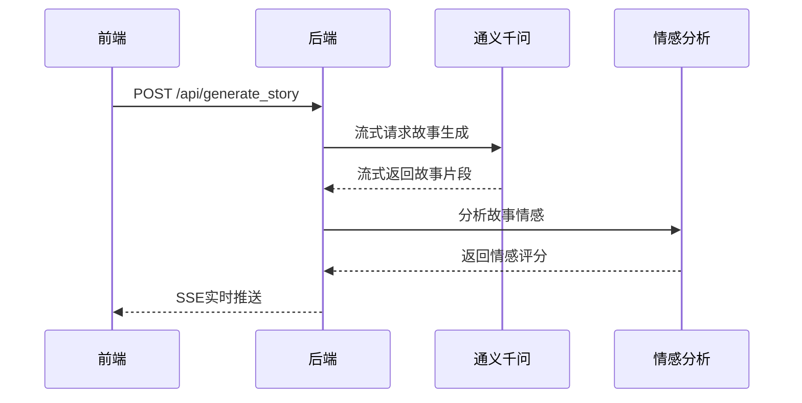

# 儿童故事生成与分析系统 - 系统架构文档

## 1. 技术架构

### 1.1 前端架构


### 1.2 后端架构


## 2. 核心技术栈

### 2.1 前端技术
- Vue 3 + Composition API
- Pinia状态管理
- Element Plus UI组件库
- Vue Router路由管理
- Axios HTTP客户端
- Server-Sent Events (SSE)实时通信

### 2.2 后端技术
- Python Flask框架
- SQLite数据库
- JWT认证
- 通义千问(qwen-turbo)API
- HuggingFace Transformers(BERT情感分析)
- LangChain集成

## 3. 核心功能实现

### 3.1 故事生成流程


### 3.2 关键代码实现

#### 后端流式处理核心
```python
@app.route('/api/generate_story', methods=['POST'])
def generate_story():
    # 构造通义千问请求
    payload = {
        "model": "qwen-turbo",
        "input": {"messages": [...]},
        "parameters": {"stream": True}
    }

    def generate():
        with requests.post(API_URL, json=payload, stream=True) as resp:
            for line in resp.iter_lines():
                if line:
                    decoded = line.decode('utf-8')
                    if decoded.startswith('data:'):
                        data = json.loads(decoded[5:])
                        if 'output' in data:
                            sentiment = analyze_sentiment(data['output']['text'])
                            yield f"data: {json.dumps({
                                'text': data['output']['text'],
                                'sentiment': sentiment
                            })}\n\n"

    return Response(generate(), mimetype='text/event-stream')
```

#### 前端流式渲染
```javascript
const generateStory = async () => {
  const response = await fetch('/api/generate_story', {
    method: 'POST',
    headers: {'Authorization': `Bearer ${token}`},
    body: JSON.stringify(params)
  });

  const reader = response.body.getReader();
  const decoder = new TextDecoder();
  
  while (true) {
    const {done, value} = await reader.read();
    if (done) break;
    
    const chunk = decoder.decode(value);
    chunk.split('\n').forEach(line => {
      if (line.startsWith('data:')) {
        const data = JSON.parse(line.substring(5));
        storyContent.value += data.text;
        updateSentimentChart(data.sentiment);
      }
    });
  }
}
```

## 4. 数据流设计

### 4.1 认证流程
1. 用户提交登录表单
2. 前端调用`/api/login`接口
3. 后端验证凭证并返回JWT token
4. 前端存储token并在后续请求的Authorization头中携带

### 4.2 状态管理
- 使用Pinia管理全局状态
- 主要状态:
  - 用户认证信息(token, user)
  - 当前对话状态
  - 故事生成状态
  - 情感分析结果

## 5. 部署架构

### 5.1 开发环境
- 前端: Vite开发服务器
- 后端: Flask开发服务器

### 5.2 生产环境建议
- 前端: Nginx静态文件服务
- 后端: Gunicorn + Nginx反向代理
- 数据库: SQLite(小规模)/PostgreSQL(大规模)
- 缓存: Redis(可选)

## 6. API文档

### 6.1 认证API
- `POST /api/login` - 用户登录
- `POST /api/register` - 用户注册

### 6.2 故事API
- `POST /api/generate_story` - 生成故事(SSE流式)
- `POST /api/analyze_sentiment` - 情感分析

## 7. 依赖管理

### 7.1 前端依赖(package.json)
```json
{
  "dependencies": {
    "vue": "^3.3.0",
    "pinia": "^2.1.0",
    "element-plus": "^2.3.0",
    "axios": "^1.4.0"
  }
}
```

### 7.2 后端依赖(requirements.txt)
```
flask>=2.0.0
flask-cors
pyjwt
requests
transformers
python-dotenv
langchain